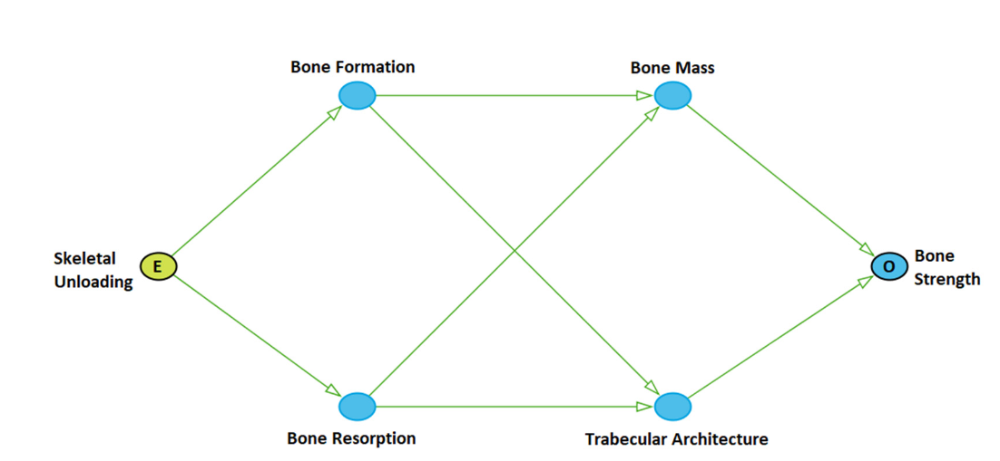
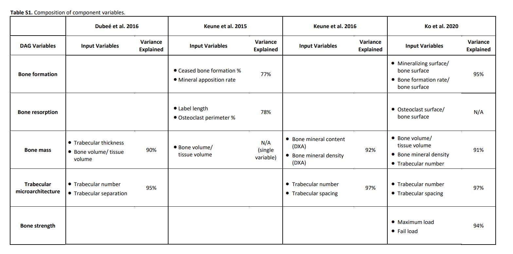

This R notebook aims to explore the potential applications of [grow-shrink](https://doi.org/10.48550/arXiv.1407.8088)

```{r}
library(dplyr)
library(bnlearn)
library(Rgraphviz)
library(psych)
```

Getting the data from csv files stored locally on device
```{r}
# If the user has downloaded the data locally
data_dir <- "../data"
```

```{r}
# Dubee
if(dir.exists(data_dir))
{
  path_lsds_15 <- file.path(data_dir, "LSDS-15_microCT_alwoodTRANSFORMED.csv")
  data_lsds_15 <- read.csv(path_lsds_15, header = TRUE)
  print("Loaded from existing file")
} else
{
  path_lsds_15 <- file.choose()
  data_lsds_15 <- read.csv(path_lsds_15, header = TRUE)
}
```

```{r}
# Keune 2015
if(dir.exists(data_dir))
{
  path_lsds_9 <- file.path(data_dir, "LSDS-9_microCT_turnerTRANSFORMED.csv")
  data_lsds_9 <- read.csv(path_lsds_9, header = TRUE)
  print("Loaded from existing file")
} else
{
  path_lsds_9 <- file.choose()
  data_lsds_9 <- read.csv(path_lsds_15, header = TRUE)
}
```

Keune 2016 is only available as an excel spreadsheet. Open it and export it as
a csv file before running this cell. Be sure to save it in the same directory.
```{r}
# Keune 2016
if(dir.exists(data_dir))
{
  path_lsds_30 <- file.path(data_dir, "LSDS-30_histomorphometry_turnerTRANSFORMED.csv")
  data_lsds_30 <- read.csv(path_lsds_30, header = TRUE)
  print("Loaded from existing file")
} else
{
  path_lsds_30 <- file.choose()
  data_lsds_30 <- read.csv(path_lsds_30, header = TRUE)
}
```

```{r}
# Ko 2020 1 of 2
if(dir.exists(data_dir))
{
  path_lsds_41 <- file.path(data_dir, "LSDS-41_peripheral_quantitative_computed_tomography_pQCT_LSDS-41_pQCT_KoTRANSFORMED.csv")
  data_lsds41 <- read.csv(path_lsds_41, header = TRUE)
  print("Loaded from existing file")
} else
{
  path_lsds_41 <- file.choose()
  data_lsds41 <- read.csv(path_lsds_41, header = TRUE)
}
```

Ko 2020 (2/2) contains 3 datasets. If you do not follow the data structure suggested
by the README.md, be sure to select them in order:

1. microCT
2. Histomorphometry
3. Bone Biomechanical 

Note: The microCT dataset contains an extra heading for the columns that groups
them together. We will take note of that here and discard the row for now:

### Femoral Trabecular Bone
- `Total_volume_TV_mm3`
- `Bone_volume_BV_mm3`	
- `Bone_volume_BV_per_total_volume_TV_mm4_per_mm4`	
- `Connectivity_density_one_per_mm3`	
- `Structure_model_index_SMI`	
- `Trabecular_number_TbN_one_per_millimeter`	
- `Trabecular_thickness_TbTh_millimeter`	
- `Trabecular_separation_TbSp_millimeter`	
- `Bone_mineral_density_BMD_mg_per_cubed_centimeter`


### Femoral Midshaft Cortical Bone
- `Cortical_thickness_CtTh_millimeter`	
- `Cortical_tissue_mineral_density_CtTMD_milligram_HA_per_cubed_centimeter`	
- `Polar_moment_of_intertia_pMOI_mm4`	
- `Maximum_moment_of_intertia_Imax_mm4`	
- `Minimum_moment_of_intertia_Imin_mm4`	
- `Cortical_bone_area_BA_mm2`	
- `Total_cross_sectional_area_TtAr_mm2`	
- `Cortical_bone_area_fraction_percent`

```{r}
# Ko 2020 2 of 2
if(dir.exists(data_dir))
{
  path_mct_lsds_40 <- file.path(data_dir, "LSDS-40_microCT_LSDS-40_microCT_KoTRANSFORMED.csv")
  data_mct_lsds_40 <- read.csv(path_mct_lsds_40, header = TRUE, skip = 1)
  print("Loaded Ko - microCT from existing file")
  
  path_hist_lsds_40 <- file.path(data_dir, "LSDS-40_histomorphometry_LSDS-40_histomorphometry_KoTRANSFORMED.csv")
  data_hist_lsds_40 <- read.csv(path_hist_lsds_40, header = TRUE)
  print("Loaded Ko - histomorphometry from existing file")
  
  path_bone_lsds_40 <- file.path(data_dir, "LSDS-40_Bone_Biomechanical_LDSD-40_biomechanical_KoTRANSFORMED.csv")
  data_bone_lsds_40 <- read.csv(path_bone_lsds_40, header = TRUE)
  print("Loaded Ko - Bone Biomechanical from existing file")  
} else
{
  # micro ct
  path_mct_lsds_40 <- file.choose()
  # histomorphometry
  path_hist_lsds_40 <- file.choose()
  # bone
  path_bone_lsds_40 <- file.choose()
  
  data_mct_lsds_40 <- read.csv(path_mct_lsds_40, header = TRUE)
  data_hist_lsds_40 <- read.csv(path_hist_lsds_40, header = TRUE)
  data_bone_lsds_40 <- read.csv(path_bone_lsds_40, header = TRUE)
}

```

For this notebook, we will be looking at the Dubee, Keune, and Ko (2/2) datasets.
These were selected because they were the ones used in the 2022 publication.
Ko (1/2) was not included because it was taken from living samples over a period of time,
which is more complicated to validate than the single measurements taken in the mCT data.

For the Ko dataset, we need to convert the scientific notation from the relevant columns
```{r}
# Remove rows with asterisk (*) in columns 4 to 15
data_hist_lsds_40 <- data_hist_lsds_40 %>%
  filter_at(vars(7:17), ~!grepl("\\*", .))

# Convert to numeric
data_hist_lsds_40 <- data_hist_lsds_40 %>%
  dplyr::mutate_at(vars(7:17), ~as.numeric(as.character(.)))
```

#TODO 
For the Keune 2015 dataset, we have a lot of different values that are missing.
This could be due to a different bone being the examined object.
- `cancellous_metaphysis_Tb_N_1per_mm` (Keune 2015, data_lsds_9)
- `cancellous_epiphysis_Tb_N_1per_mm` (Keune 2015, data_lsds_9)
- `cancellous_epiphysis_Tb_Sp_micrometer` (Keune 2015, data_lsds_9)
- `cancellous_metaphysis_Tb_Sp_micrometer` (Keune 2015, data_lsds_9)
```{r}
# Placeholder
```

Subset columns
```{r}
data_bone_lsds_40 <- data_bone_lsds_40[,c(1,3:4,8:10)]
data_hist_lsds_40 <- data_hist_lsds_40[!(is.na(data_hist_lsds_40$Source.Name)),c(1,7:11)]
data_mct_lsds_40 <- data_mct_lsds_40[,c(1,10,13:17)]
```

Rename columns
```{r}
names(data_bone_lsds_40) <- c("ID","PWB","duration","stiffness","load.max","load.fail")
names(data_hist_lsds_40) <- c("ID","OBSBS","OCSBS",'MSBS',"MAR","BFRBS")
names(data_mct_lsds_40) <- c("ID","BVTV","trab.num","trab.thick","trab.sep","BMD","cort.thick")

data_bone_lsds_40
data_hist_lsds_40
data_mct_lsds_40
```

Create indicators of source file
```{r}
data_bone_lsds_40$data_bone_lsds_40 <- 1
data_hist_lsds_40$data_hist_lsds_40 <- 1
data_mct_lsds_40$data_mct_lsds_40 <- 1
```

```{r}
data_hist_lsds_40
```


Merge files
```{r}
# Merge files
ko12   <- merge(data_bone_lsds_40,data_hist_lsds_40,by="ID",all.x=T,all.y=T)
ko123  <- merge(ko12,data_mct_lsds_40,by="ID",all=T)
```

Fill in missing indicators with 0
```{r}
ko123$data_bone_lsds_40[is.na(ko12$data_bone_lsds_40)] <-0
ko123$data_hist_lsds_40[is.na(ko12$data_hist_lsds_40)] <-0
ko123$data_mct_lsds_40[is.na(ko12$data_mct_lsds_40)] <-0
```

Keep the rows we need
```{r}
ko <- ko123[!(is.na(ko123$stiffness)),]
  ko$unload    <- 0*(ko$PWB=='PWB100')+30*(ko$PWB=="PWB70")+60*(ko$PWB=="PWB40")+80*(ko$PWB =="PWB20")
  ko$dur   <- 7*(ko$duration=='1wk')+14*(ko$duration=='2wk')+28*(ko$duration=='4wk')
ko <- ko[,c('BVTV','BMD','trab.sep','trab.num','MSBS','OCSBS','BFRBS','load.max','load.fail','unload','dur')]
```

```{r}
data_lsds_9
```
```{r}
data_lsds_15
```


```{r}
data_lsds_30
```

```{r}
ko
```

# Composite Variables
Next we need to group the columns provided in the CSV file into composite variables.
They need to be related so our groupings need to be validated and checked by someone
who is much more familiar with bones than the author of this notebook!
We have a graph that illustrates the nodes from this 2022 publication:


The publication laid out the following composite variables



## Transformed CSV File Variables:

### Bone Formation
- `Ceased_bone_formation_CeasedBF_percent` (Keune 2016, data_lsds_30)
- `Mineral_apposition_rate_MAR_micrometers_per_day` (Keune 2016, data_lsds_30)
- `Mineralized_surface_MS_per_bone_surface_BS_percent` (Ko, data_hist_lsds_40)
- `Bone_formation_rate_BFR_per_bone_surface_BS_percent` (Ko, data_hist_lsds_40)

### Bone Resorption
- `Label_length_LL_millimeter_per_millimeters_squared` (Keune 2016, data_lsds30)
- `Osteoclast_perimeter_OsCperi_percent` (Keune 2016, data_lsds30)
- `Osteoclast_surface_OcS_per_bone_surface_BS_percent`(Ko, data_hist_lsds_40)

### Bone Mass
- `trabecular_thickness_mm` (Dubee, data_lsds_15)
- `percent_bone_volume_bvtv_percent` (Dubee, data_lsds_15)
- `Bone_volume_BVTV_percent` (Keune 2016, data_lsds30)
- Bone mineral content (DXA)? (REMOVED FROM TRANSFORMED Keune 2015, data_lsds_9)
- Bone mineral density (DXA)? (REMOVED FROM TRANSFORMED Keune 2015, data_lsds_9)
- `Bone_volume_BV_per_total_volume_TV_mm4_per_mm4` (Ko, data_mct_lsds_40)
- `Bone_mineral_density_BMD_mg_per_cubed_centimeter` (Ko, data_mct_lsds_40)
- `Trabecular_number_TbN_one_per_millimeter` (Ko, data_mct_lsds_40)

### Trabecular Architecture
- `trabecular_number_1_by_mm` (Dubee, data_lsds_15)
- `trabecular_separation_mm` (Dubee, data_lsds_15)
- `cancellous_metaphysis_Tb_N_1per_mm` (Keune 2015, data_lsds_9)
- `cancellous_epiphysis_Tb_N_1per_mm` (Keune 2015, data_lsds_9)
- `cancellous_epiphysis_Tb_Sp_micrometer` (Keune 2015, data_lsds_9)
- `cancellous_metaphysis_Tb_Sp_micrometer` (Keune 2015, data_lsds_9)
- `Trabecular_number_TbN_one_per_millimeter` (Ko, data_mct_lsds_40)
- `Trabecular_separation_TbSp_millimeter` (Ko, data_mct_lsds_40)

### Bone Strength
- `maximum_load_N_newtons` (Ko, data_bone_lsds_40)
- `failure_load_newtons` (Ko, data_bone_lsds_40)
```{r}
# Dubee
dubee_gs_input <- data.frame(treatment = rep(NA, 37))

# Treatment (Factor Value)
dubee_gs_input$treatment <- as.factor(data_lsds_15$Factor.Value)

# Bone Mass
dubee_bone_mass <- data_lsds_15[, c("trabecular_thickness_mm", 
                                    "percent_bone_volume_bvtv_percent")]
dubee_composite_bm <- psych::pca(r = dubee_bone_mass, nfactors = 1, scores = TRUE)
dubee_gs_input$bone_mass <- BiocGenerics::as.vector(dubee_composite_bm$scores)

# Trabecular Architecture
dubee_tb_arch <- data_lsds_15[, c("trabecular_number_1_by_mm",
                                  "trabecular_separation_mm")]
dubee_composite_tba <- psych::pca(r = dubee_tb_arch, nfactors = 1, scores = TRUE)
dubee_gs_input$trabec_arch <- BiocGenerics::as.vector(dubee_composite_tba$scores)

```

#TODO
Revisit after handling null values
```{r}
# Keune 2015
keune_2015_gs_input <- data.frame(trabec_arch = rep(NA, 102))

# Trabecular Architecture
keune_2015_tba <- data_lsds_9[, c("cancellous_metaphysis_Tb_N_1per_mm",
                                  "cancellous_epiphysis_Tb_N_1per_mm",
                                  "cancellous_epiphysis_Tb_Sp_micrometer",
                                  "cancellous_metaphysis_Tb_Sp_micrometer")]
keune_2015_composite_tba <- psych::pca(r = keune_2015_tba, nfactors = 1, scores = TRUE)
keune_2015_gs_input$trabech_arch <- BiocGenerics::as.vector(keune_2015_composite_tba$scores)
```


```{r}
# Keune 2016
keune_2016_gs_input <- data.frame(treatment = rep(NA, 22))

# Treatment
keune_2016_gs_input$treatment <- as.factor(data_lsds_30$Spaceflight)

# Bone Formation
keune_2016_bf <- data_lsds_30[, c("Ceased_bone_formation_CeasedBF_percent",
                                  "Mineral_apposition_rate_MAR_micrometers_per_day")]
keune_2016_composite_bf <- psych::pca(r = keune_2016_bf, nfactors = 1, scores = TRUE)
keune_2016_gs_input$bone_formation <- BiocGenerics::as.vector(keune_2016_composite_bf$scores)

# Bone Resorption
keune_2016_br <- data_lsds_30[, c("Label_length_LL_millimeter_per_millimeters_squared",
                                  "Osteoclast_perimeter_OsCperi_percent")]
keune_2016_composite_br <- psych::pca(r = keune_2016_br, nfactors = 1, scores = TRUE)
keune_2016_gs_input$bone_resorption <- BiocGenerics::as.vector(keune_2016_composite_br$scores)

# Bone Mass (is PCA necessary? Uncomment pca line if needed) 
keune_2016_bm <- data_lsds_30[, c("Bone_volume_BVTV_percent")]
# keune_2016_composite_bm <- psych::pca(r = keune_2016_bm, nfactors = 1, scores = TRUE)
keune_2016_gs_input$bone_mass <- BiocGenerics::as.vector(keune_2016_bm)

```

```{r}
# Ko 2020 (2/2)
mass <- pca(r=ko[,c("BVTV","BMD")], nfactors = 1, scores = T)
trab <- pca(r=ko[,c("trab.sep","trab.num")], nfactors = 1, scores = T)
form   <- pca(r=ko[,c("MSBS","BFRBS")], nfactors = 1, scores = T)
stren <- pca(r=ko[,c("load.max","load.fail")], nfactors = 1, scores = T)

ko$mass <- as.vector(mass$scores[,1])
ko$trab <- as.vector(trab$scores[,1])
ko$stren <- as.vector(stren$scores[,1])
ko$expose <- ((ko$unload*ko$dur)-mean(ko$unload*ko$dur))/(sd(ko$unload*ko$dur))
ko$resorp <- scale(ko$OCSBS)
ko$form   <- as.vector(form$scores)


ko <- ko[,c("unload","dur","expose","mass","trab","stren","resorp","form")]
```


Here are the composite variables as their own dataframes. They are ready to be
fed into the Grow-Shrink Algorithm!
```{r}
dubee_gs_input
```


```{r}
keune_2015_gs_input
```
```{r}
keune_2016_gs_input
```
```{r}
ko
```

```{r}
dubee_dag <- bnlearn::gs(dubee_gs_input)
```
```{r}
keune2015_dag <- bnlearn::gs(keune_2015_gs_input)
```
```{r}
keune2016_dag <- bnlearn::gs(keune_2016_gs_input)
```
```{r}
ko_dag <- bnlearn::gs(ko)
```


# Dubee DAG
```{r}
graph_dag <- bnlearn::as.graphNEL(dubee_dag)

plot(graph_dag)
text(x = 250, y = 500, labels = "Dubee DAG", font = 4)

```
```{r}
cex_dubee_dag <- bnlearn::cextend(x = dubee_dag, strict = TRUE)
graph_dag <- bnlearn::as.graphNEL(cex_dubee_dag)

plot(graph_dag)
text(x = 250, y = 500, labels = "Consistent extension of Dubee DAG", font = 4)
```
# Keune 2016 DAG
```{r}
graph_dag <- bnlearn::as.graphNEL(keune2016_dag)

plot(graph_dag)
text(x = 100, y = 500, labels = "Keune 2016 DAG", font = 4)

```

```{r}
cex_k16_dag <- bnlearn::cextend(x = keune2016_dag, strict = TRUE)
graph_dag <- bnlearn::as.graphNEL(cex_k16_dag)

plot(graph_dag)
text(x = 105, y = 500, labels = "Consistent extension of Keune 2016 DAG", font = 4)
```

# Ko (2/2) DAG
```{r}
graph_dag <- bnlearn::as.graphNEL(ko_dag)

plot(graph_dag)
text(x = 100, y = 500, labels = "Ko (2/2) DAG", font = 4)

```

```{r}
cex_ko_dag <- bnlearn::cextend(x = ko_dag, strict = TRUE)
graph_dag <- bnlearn::as.graphNEL(cex_ko_dag)

plot(graph_dag)
text(x = 105, y = 500, labels = "Consistent extension of Ko (2/2) DAG", font = 4)
```